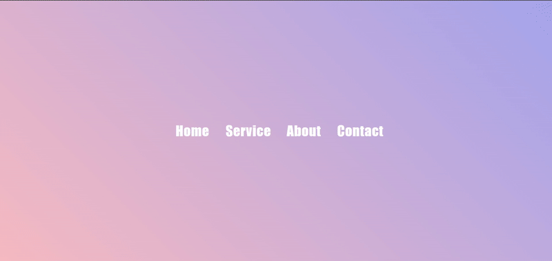
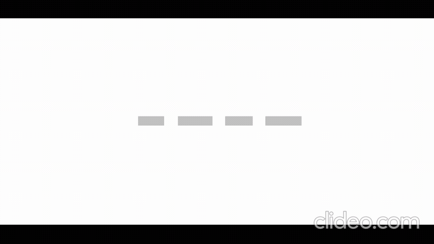
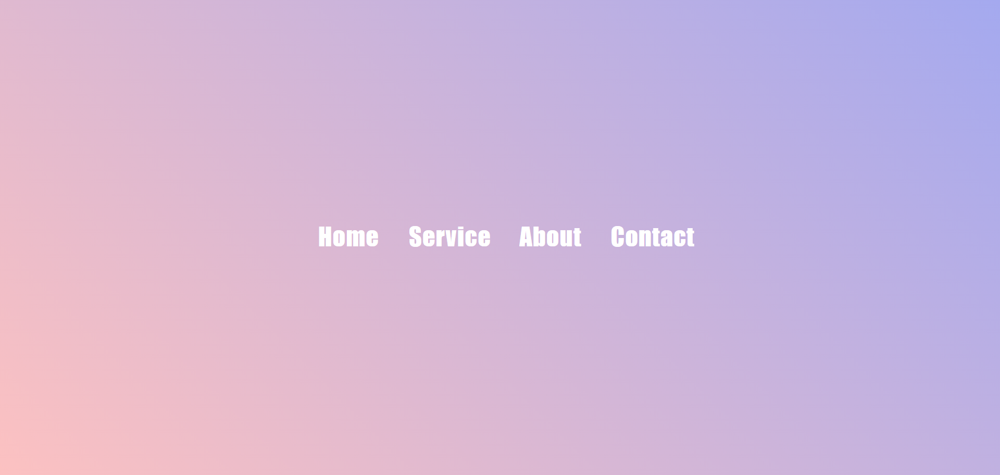
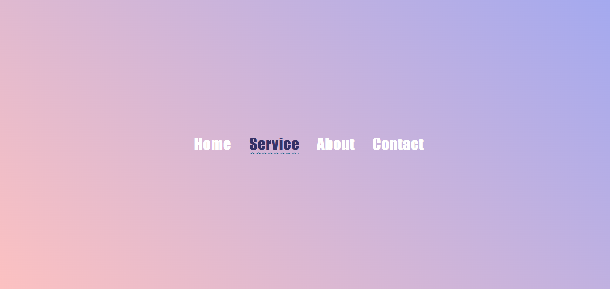
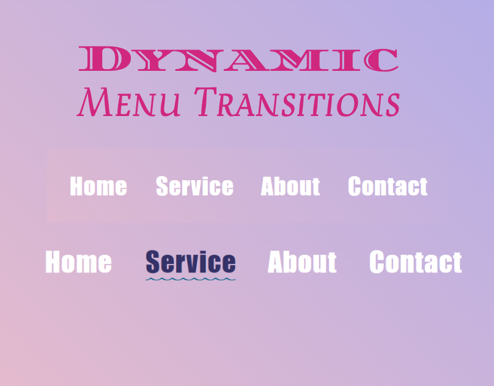

## HoverLine: Dynamic Menu Transitions

<a href="https://www.linkedin.com/in/dharmendraverma95/" target="_blank">LinkedIn Profile </a>

<a href="https://www.behance.net/dhirukumar" target="_blank">Behance Profile </a>

## Project Overview
HoverLine is a modern and interactive menu hover effect that adds a dynamic line animation to your menu items. This lightweight feature enhances the user experience by providing smooth transitions and visual feedback on hover, making it perfect for modern websites and applications.

## Features
- Sleek Hover Effect: Adds a dynamic line animation on hover.
- Customizable: Easily tweak the colors, speed, and style of the animation.
- Lightweight: Minimal CSS and JavaScript for fast performance.
- Responsive: Works seamlessly on all devices and screen sizes.
- Easy to Implement: Just add a few lines of code to your project.
  

###### Lang
<ul>
  <li>HTML5</li>
  <li>SCSS</li>
  <li>ChatGPT [For Content]</li>
  <li>Desgin in Abode XD</li>
</ul>

 
Desktop Design 

 
Desktop UI UX Design 

 
Desktop Design UI UX Layout 

 
Desktop Design 

Cover 
